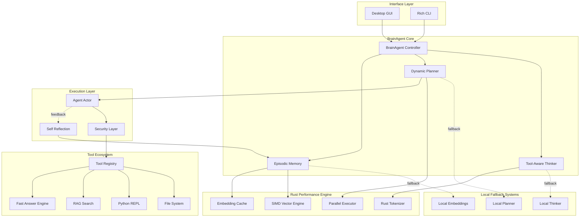

#  MyAgent - Autonomous AI Agent Framework

> A production-ready Python framework for building autonomous AI agents with ReAct reasoning, tool integration, and agentic memory management. Now featuring a professional PySide6 Desktop GUI!

[](https://www.python.org/downloads/)
[](LICENSE)
[](/)
---

##  Overview

**MyAgent** is a sophisticated autonomous agent framework designed to bridge the gap between large language models and real-world task execution. It implements the **ReAct** (Reasoning + Acting) pattern, enabling agents to think through complex problems, select appropriate tools, execute them safely, and adapt based on observations.

###  New in v1.2: The Rust Revolution 🚀
- **Rust Accelerator Engine**: Core performance logic (Vector math, Ranking, Tokenization) rewritten in Rust for up to **12.8x speedup**.
- **SIMD-Accelerated Memory**: Lightning-fast episodic memory ranking using handwritten Rust kernels.
- **Embedding Cache**: Concurrent Rust-side caching to eliminate redundant embedding API latency.
- **Parallel Orchestration**: Tokio-backed async parallelism for multi-request agent planning.
- **Exact Token Counting**: Zero-cost subword tokenization via the Rust `tokenizers` crate.

---

##  Key Features

###  **High-Performance Hybrid Engine**
- **Rust/Python Hybrid**: Clean PyO3 + Maturin integration. Python for reasoning; Rust for the data plane.
- **SIMD Optimized**: Vector similarities and ranking use manual SIMD and Rayon parallelism.
- **Async Orchestrator**: Built-in Rust runtime for firing parallel LLM requests.

###  **Desktop & CLI Interfaces**
- **PySide6 Dashboard**: A premium dark-themed desktop app with "Internal Process" monitoring.
- **Rich CLI**: Beautiful terminal output with panels, tables, and live status updates.
- **Multithreaded**: Agent runs in the background to keep the UI responsive.

###  **Intelligence Layer**
- **Hybrid Reasoning**: Automatic failover to local LLMs (Qwen2.5) for reliability.
- **ReAct Loop**: Reasoning → Acting → Observing cycle for adaptive decision-making.
- **Brain Agent**: Central orchestrator managing thought processes and tool selection.
- **Self-Reflection (v1.3)**: Post-task meta-cognition to evaluate success, detect mistakes, and learn lessons.
- **Episodic Memory**: High-speed local embeddings with Rust-accelerated ranking.

###  **Tool Ecosystem (Secured)**
- **11+ Built-in Tools**: File system, Python REPL, web search, FastAnswer, and more.
- **Production Security**: `@restrict_path`, `@validate_code`, and `@safe_execution` decorators.
- **Workspace Root Control**: Configurable sandbox boundaries for file tools.

---

##  Architecture



---

##  Installation

### Prerequisites
- Python 3.12 or higher
- `libxcb-cursor0` (for Linux GUI support)

```bash
# Ubuntu/Debian
sudo apt-get install libxcb-cursor0
```

### Quick Start

```bash
# Clone and enter
git clone https://github.com/blackeagle686/myAgent.git
cd myAgent

# Setup environment
python -m venv .venv
source .venv/bin/activate
pip install -r requirements.txt
```

---

##  Usage

### Option 1: The Desktop GUI (Recommended)
Launch the premium dashboard to see the agent's internal thought process in real-time.
```bash
python3 run_gui.py
```

### Option 2: The Rich CLI
Run the agent directly from your terminal with visual status updates.
```bash
python3 run_agent.py "What is the capital of Egypt?" --verbose
```

---

##  Project Structure

- `core/agent/`: The heart of the framework (Brain, Planner, Loop).
- `core/tools/`: The secure tool ecosystem and decorators.
- `gui/`: PySide6 implementation and modern dark styling.
- `config.py`: Central configuration for models (OpenRouter/Local) and API keys.
- `ARCHITECTURE.md`: Deep dive into core module logic.

---

##  Project Flow: The Self-Improvement Loop

MyAgent operates on a sophisticated **Observe → Reflect → Learn → Improve** cycle. Here is how a request travels through the system:

1.  **Decomposition (Thinker)**: The `Thinker` analyzes the request and breaks it into multiple manageable sub-tasks. It uses **Rust-based tokenization** for exact context management.
2.  **Adaptive Planning (Planner)**: The `Planner` decides the next best action step-by-step. If a high-tier API fails, it automatically fails over to **Local Fallback Systems**.
3.  **Secure Execution (Actor)**: The `Actor` executes tools through a `Security Layer`. Every operation is monitored, caught if it fails, and returned as an observation.
4.  **Episodic Storage**: The full trajectory is recorded. **SIMD-accelerated vectors** rank past experiences to see if the agent has faced similar tasks before.
5.  **Self-Reflection (Reflector)**: Once the task is finished, the `Reflector` analyzes the entire process. It identifies mistakes, gives a performance rating, and generates **actionable lessons**.
6.  **Continuous Improvement**: These lessons are injected into the agent's memory, ensuring that the next time a similar request arrives, the agent is smarter and faster.

---

##  Core Components

### **Hybrid Intelligence & Fallback**
The agent uses a **Hybrid LLM Stack**. By default, it uses powerful models via OpenRouter (e.g., Llama 3.1 405B). If an API error occurs, it automatically switches to local models (Qwen2.5-3B for Thinking, Qwen2.5-Coder for Planning) to ensure continuous operation.

### **Self-Reflection & Improvement**
MyAgent now includes an integrated **Self-Reflection System** that triggers after every task completion. It evaluates its own performance, identifies mistakes, and generates **Lessons Learned** which are stored in its episodic memory. These lessons are then used to inform and improve future decision-making, creating a continuous improvement loop.

### **Local Embeddings**
VDB operations and episodic memory now use `sentence-transformers/all-MiniLM-L6-v2` locally on **CPU**, providing consistent performance and 384-dimensional vector support without external dependencies.

### **Security Stack**
Every tool is wrapped in a multi-layer security stack:
- `@safe_execution`: Catches crashes and returns them as observations.
- `@restrict_path`: Confines the agent to the `WORKSPACE_ROOT`.
- `@validate_code`: Blocks dangerous Python patterns (e.g., `os.system`).

---

##  License & Authors

**Mohammed Alaa**
- GitHub: [@blackeagle686](https://github.com/blackeagle686)
- Email: mathematecs1@gmail.com
