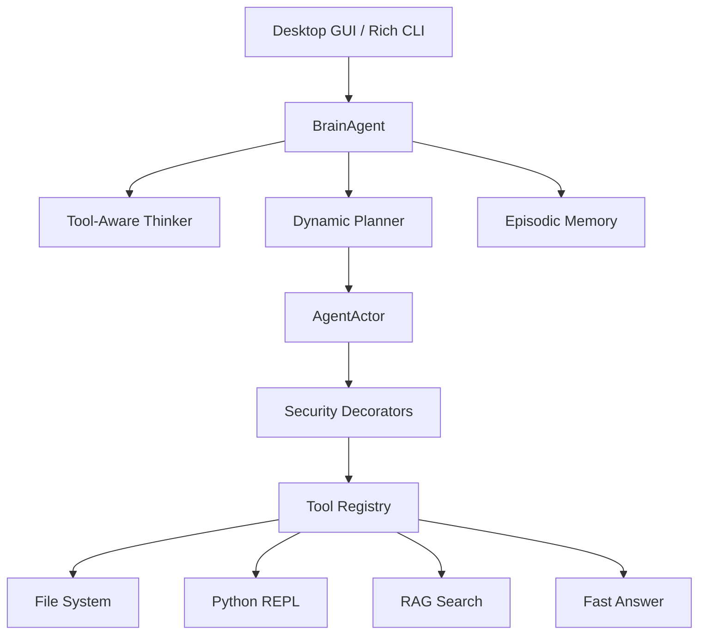

# 🤖 MyAgent - Autonomous AI Agent Framework

> A production-ready Python framework for building autonomous AI agents with ReAct reasoning, tool integration, and agentic memory management. Now featuring a professional PySide6 Desktop GUI!

[](https://www.python.org/downloads/)
[](LICENSE)
[](/)

---

## 🚀 Overview

**MyAgent** is a sophisticated autonomous agent framework designed to bridge the gap between large language models and real-world task execution. It implements the **ReAct** (Reasoning + Acting) pattern, enabling agents to think through complex problems, select appropriate tools, execute them safely, and adapt based on observations.

### 🌟 New in v1.1
- **Professional Desktop GUI**: A sleek PySide6-based dashboard to visualize thinking/planning live.
- **Enhanced CLI Experience**: Rich-powered console with structured reasoning and status spinners.
- **Tool-Aware Decomposition**: The Thinker now "knows" available tools during the first analysis phase.
- **FastAnswerTool**: Blazing fast direct responses for simple factual queries.
- **Workspace Sandboxing**: Restricted file operations to the project root for production safety.

---

## ✨ Key Features

### 🖥️ **Desktop & CLI Interfaces**
- **PySide6 Dashboard**: A premium dark-themed desktop app with "Internal Process" monitoring.
- **Rich CLI**: Beautiful terminal output with panels, tables, and live status updates.
- **Multithreaded**: Agent runs in the background to keep the UI responsive.

### 🧠 **Intelligence Layer**
- **ReAct Loop**: Reasoning → Acting → Observing cycle for adaptive decision-making.
- **Brain Agent**: Central orchestrator managing thought processes and tool selection.
- **Hierarchical Planning**: Decomposes complex goals into atomic tasks.
- **Episodic Memory**: Learns from past experiences via vector-based retrieval.

### 🛠️ **Tool Ecosystem (Secured)**
- **11+ Built-in Tools**: File system, Python REPL, web search, FastAnswer, and more.
- **Production Security**: `@restrict_path`, `@validate_code`, and `@safe_execution` decorators.
- **Workspace Root Control**: Configurable sandbox boundaries for file tools.

---

## 🏗️ Architecture



---

## 📦 Installation

### Prerequisites
- Python 3.12 or higher
- `libxcb-cursor0` (for Linux GUI support)

```bash
# Ubuntu/Debian
sudo apt-get install libxcb-cursor0
```

### Quick Start

```bash
# Clone and enter
git clone https://github.com/blackeagle686/myAgent.git
cd myAgent

# Setup environment
python -m venv .venv
source .venv/bin/activate
pip install -r requirements.txt
```

---

## 🚀 Usage

### Option 1: The Desktop GUI (Recommended)
Launch the premium dashboard to see the agent's internal thought process in real-time.
```bash
python3 run_gui.py
```

### Option 2: The Rich CLI
Run the agent directly from your terminal with visual status updates.
```bash
python3 run_agent.py "What is the capital of Egypt?" --verbose
```

---

## 📚 Project Structure

- `core/agent/`: The heart of the framework (Brain, Planner, Loop).
- `core/tools/`: The secure tool ecosystem and decorators.
- `gui/`: PySide6 implementation and modern dark styling.
- `config.py`: Central configuration for models (OpenRouter/Local) and API keys.
- `ARCHITECTURE.md`: Deep dive into core module logic.

---

## 🔧 Core Components

### **Thinker & Planner**
The **Thinker** first analyzes the problem using tool-aware context, then the **Planner** decides the exact tool sequence to achieve the goal.

### **Security Stack**
Every tool is wrapped in a multi-layer security stack:
- `@safe_execution`: Catches crashes and returns them as observations.
- `@restrict_path`: Confines the agent to the `WORKSPACE_ROOT`.
- `@validate_code`: Blocks dangerous Python patterns (e.g., `os.system`).

---

## 🛡️ License & Authors

**Mohammed Alaa**
- GitHub: [@blackeagle686](https://github.com/blackeagle686)
- Email: mathematecs1@gmail.com

Licensed under the MIT License. Built with ❤️ for the AI community.
